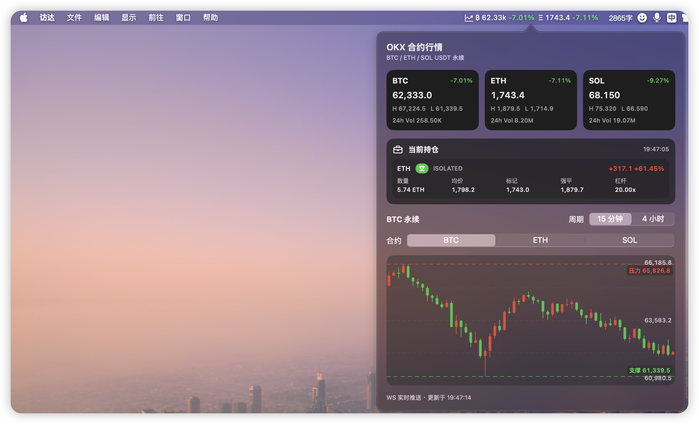

# okx-menubar

[English](#english) | [中文版](#中文版)

---

## English

A native macOS menu bar app for monitoring OKX perpetual swap prices, candlestick charts, and current positions.

> This is an unofficial OKX utility for personal use. It is not affiliated with OKX.



## Features

- Real-time OKX perpetual swap quotes in the macOS menu bar
- Supports `BTC-USDT-SWAP`, `ETH-USDT-SWAP`, and `SOL-USDT-SWAP`
- Popup view with 15m and 4H candlestick charts
- Current perpetual positions via OKX private REST API
- Position polling every 30 seconds when API credentials are configured
- Left click to open the popup, right click for **Settings** / **Quit**
- Opening the popup refreshes only the **currently selected contract** candlestick data
- Switching tabs refreshes only the newly selected contract candlestick data

## Screenshot

The app lives in the macOS menu bar and shows:

- BTC / ETH headline prices in the status item
- ticker cards for supported contracts
- current positions
- 15m / 4H candlestick charts

## Requirements

- macOS 13+
- Xcode Command Line Tools
- Swift 5.9+
- Network access to `https://www.okx.com`

## Quick Start

### Run in development mode

```bash
swift run OKXMenuBar
```

After launch, the app appears in the macOS menu bar.

### Build a `.app` bundle

```bash
make app
open .build/OKXMenuBar.app
```

The generated app bundle is located at:

```text
.build/OKXMenuBar.app
```

`Info.plist` is configured with `LSUIElement=true`, so the app runs as a menu bar utility without a Dock icon.

### Build a `.dmg` package

```bash
make dmg VERSION=v0.1.0
```

The generated DMG is located at:

```text
dist/okx-menubar-v0.1.0-macos.dmg
```

## Usage

- **Left click** the status item to open the popup
- **Right click** the status item to open the menu
  - **Settings**
  - **Quit**
- The popup automatically refreshes the K-line data for the currently selected contract
- The popup is sized to show the full content whenever possible, instead of forcing a scroll view by default

## Configure OKX Read-Only Credentials

Position data requires OKX private API access.

Use a **read-only** OKX API key. Do **not** use a key with trading or withdrawal permissions.

### Option 1: configure from the app UI

Right click the menu bar item and open **Settings**, then fill in:

- API Key
- Secret Key
- Passphrase

The credentials are saved to:

```text
~/.okx-menubar.json
```

The file permission is set to `600` by the app.

### Option 2: create the config file manually

```bash
cat > ~/.okx-menubar.json <<'JSON'
{
  "apiKey": "your OKX API key",
  "secretKey": "your OKX secret key",
  "passphrase": "your OKX API passphrase"
}
JSON
chmod 600 ~/.okx-menubar.json
```

### Option 3: use environment variables

```bash
OKX_API_KEY=xxx \
OKX_SECRET_KEY=xxx \
OKX_PASSPHRASE=xxx \
swift run OKXMenuBar
```

## Supported Contracts

The default contracts are defined in:

```text
Sources/OKXMenuBar/Models.swift
```

Current defaults:

- `BTC-USDT-SWAP`
- `ETH-USDT-SWAP`
- `SOL-USDT-SWAP`

You can add more contracts by editing `Contract.defaults`.

## Position Quantity Notes

OKX returns perpetual position size in **contracts** (`pos`), not always in base asset units directly.

This app converts the returned size using the contract value (`ctVal`) so positions are displayed in asset units such as:

- `5.74 ETH`
- `0.12 BTC`
- `35 SOL`

## Development

Useful commands:

```bash
swift run OKXMenuBar
make build
make app
make dmg VERSION=v0.1.0
make clean
```

There is also a helper script:

```bash
./scripts/run-app.sh
```

## Security

- This repository should not contain real API credentials
- Local credentials are loaded from environment variables or `~/.okx-menubar.json`
- Do not copy your personal credential file into the repository directory
- Before publishing, make sure `.build/` and other local artifacts are excluded from git

## License

MIT

---

## 中文版

一个原生 macOS 菜单栏应用，用于查看 OKX 永续合约行情、K 线和当前持仓。

> 本项目是非官方 OKX 工具，仅供个人使用，与 OKX 无官方关联。


## 功能特性

- 在 macOS 菜单栏中实时显示 OKX 永续合约价格
- 默认支持 `BTC-USDT-SWAP`、`ETH-USDT-SWAP`、`SOL-USDT-SWAP`
- 弹窗内查看 15 分钟和 4 小时 K 线
- 通过 OKX 私有 REST API 查看当前合约持仓
- 配置 API 凭证后，每 30 秒轮询一次持仓
- **左键** 打开弹窗，**右键** 打开菜单（设置 / 退出）
- 打开弹窗时，只刷新**当前选中合约**的 K 线数据
- 切换 tab 时，只刷新**新选中的合约**的 K 线数据

## 效果图

应用常驻 macOS 顶部菜单栏，主要包含：

- 状态栏中的 BTC / ETH 价格摘要
- 各合约行情卡片
- 当前持仓信息
- 15m / 4H K 线图

## 环境要求

- macOS 13+
- Xcode Command Line Tools
- Swift 5.9+
- 能访问 `https://www.okx.com`

## 快速开始

### 开发模式运行

```bash
swift run OKXMenuBar
```

启动后，应用会出现在 macOS 顶部菜单栏中。

### 构建 `.app` 应用包

```bash
make app
open .build/OKXMenuBar.app
```

构建产物位于：

```text
.build/OKXMenuBar.app
```

`Info.plist` 已设置 `LSUIElement=true`，因此应用运行时不会在 Dock 中显示图标。

### 构建 `.dmg` 安装包

```bash
make dmg VERSION=v0.1.0
```

生成的 DMG 位于：

```text
dist/okx-menubar-v0.1.0-macos.dmg
```

## 使用方式

- **左键点击** 状态栏图标：打开行情弹窗
- **右键点击** 状态栏图标：打开菜单
  - **设置**
  - **退出**
- 弹窗会自动刷新当前选中合约的 K 线
- 弹窗会尽量按照内容自适应高度，避免默认必须滚动才能看全

## 配置 OKX 只读凭证

查看持仓需要使用 OKX 私有 API。

建议只使用 **只读 API Key**，**不要**使用带交易权限或提币权限的 Key。

### 方式一：在应用 UI 中配置

右键菜单栏图标，打开 **Settings**，然后填写：

- API Key
- Secret Key
- Passphrase

凭证会保存到：

```text
~/.okx-menubar.json
```

应用会自动将该文件权限设置为 `600`。

### 方式二：手动创建本地配置文件

```bash
cat > ~/.okx-menubar.json <<'JSON'
{
  "apiKey": "你的 OKX API Key",
  "secretKey": "你的 OKX Secret Key",
  "passphrase": "你的 OKX API Passphrase"
}
JSON
chmod 600 ~/.okx-menubar.json
```

### 方式三：使用环境变量

```bash
OKX_API_KEY=xxx \
OKX_SECRET_KEY=xxx \
OKX_PASSPHRASE=xxx \
swift run OKXMenuBar
```

## 支持的合约

默认合约定义在：

```text
Sources/OKXMenuBar/Models.swift
```

当前默认值：

- `BTC-USDT-SWAP`
- `ETH-USDT-SWAP`
- `SOL-USDT-SWAP`

如果你想支持更多合约，可以修改 `Contract.defaults`。

## 持仓数量说明

OKX 返回的永续持仓数量字段 `pos` 通常表示的是**张数 / 合约数**，不一定直接等于币数量。

本项目会结合合约面值 `ctVal` 转换为基础币种数量，因此会显示成类似：

- `5.74 ETH`
- `0.12 BTC`
- `35 SOL`

## 开发命令

常用命令：

```bash
swift run OKXMenuBar
make build
make app
make dmg VERSION=v0.1.0
make clean
```

也可以直接使用辅助脚本：

```bash
./scripts/run-app.sh
```

## 安全说明

- 仓库中不应包含真实 API 凭证
- 本地凭证从环境变量或 `~/.okx-menubar.json` 读取
- 不要把你个人的凭证文件复制到仓库目录中
- 发布前请确保 `.build/` 等本地产物已被 git 忽略

## 许可证

MIT
